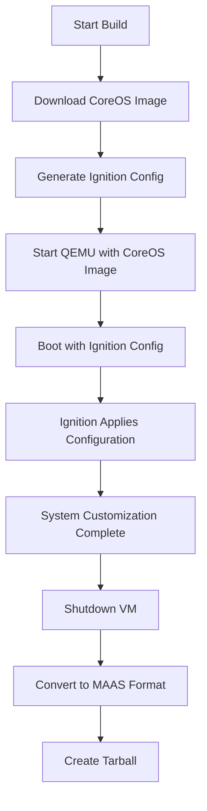

# CoreOS Support Design Document

## Overview

This design adds Fedora CoreOS (FCOS) support to the packer-maas project by creating a new template that leverages CoreOS's unique architecture. Unlike traditional Linux distributions that use installation ISOs and kickstart files, CoreOS uses pre-built disk images with Ignition configuration for first-boot customization.

The implementation focuses on Fedora CoreOS initially rather than Red Hat Enterprise Linux CoreOS (RHCOS) due to licensing and availability constraints, while providing a foundation that could support RHCOS in the future.

## Architecture

### Core Differences from Traditional Templates

**Traditional Approach (RHEL/CentOS/Ubuntu):**
```
ISO → Anaconda/Installer → Kickstart → Custom Installation → MAAS Image
```

**CoreOS Approach:**
```
Pre-built QEMU Image → Ignition Configuration → First Boot Customization → MAAS Image
```

### Directory Structure

```
fcos/
├── README.md                    # Documentation and build instructions
├── Makefile                     # Build automation following project patterns
├── fcos.pkr.hcl                # Main Packer template
├── http/                       # Ignition configuration templates
│   └── config.ign.pkrtpl.hcl   # Templated Ignition configuration
└── scripts/                    # Optional customization scripts
    └── post-ignition.sh        # Post-ignition customization if needed
```

## Components and Interfaces

### 1. Packer Template (fcos.pkr.hcl)

**Key Variables:**
```hcl
variable "fcos_stream" {
  type        = string
  default     = "stable"
  description = "CoreOS stream: stable, testing, or next"
}

variable "fcos_version" {
  type        = string
  default     = "latest"
  description = "Specific CoreOS version or 'latest'"
}

variable "architecture" {
  type        = string
  default     = "amd64"
  description = "Target architecture (amd64 or arm64)"
}

variable "custom_ignition_url" {
  type        = string
  default     = ""
  description = "Optional URL to custom Ignition config"
}
```

**QEMU Source Configuration:**
- Uses existing QEMU architecture patterns from other templates
- Downloads pre-built CoreOS QEMU images instead of using ISOs
- Configures UEFI boot with the same OVMF patterns as RHEL templates
- Uses kernel command line parameters to specify Ignition config location

### 2. Image Download Strategy

**Dynamic Download Approach:**
```bash
# Pre-build step in Makefile
coreos-installer download -s ${STREAM} -p qemu -f qcow2.xz --decompress -C ./
```

**Advantages:**
- Always gets latest version for specified stream
- Handles architecture-specific downloads automatically
- Integrates with CoreOS's official tooling

### 3. Ignition Configuration System

**Template Structure (config.ign.pkrtpl.hcl):**
```json
{
  "ignition": {
    "version": "3.4.0"
  },
  "passwd": {
    "users": [
      {
        "name": "core",
        "sshAuthorizedKeys": ["${SSH_KEY}"],
        "groups": ["sudo", "docker"]
      }
    ]
  },
  "systemd": {
    "units": [
      {
        "name": "cloud-init.service",
        "enabled": true
      }
    ]
  },
  "storage": {
    "files": [
      {
        "path": "/etc/cloud/cloud.cfg.d/10_maas.cfg",
        "contents": {
          "inline": "datasource_list: [MAAS]"
        }
      }
    ]
  }
}
```

**MAAS Integration Elements:**
- Configures cloud-init for MAAS datasource compatibility
- Sets up core user with SSH key access
- Enables necessary systemd services
- Configures networking for MAAS management

### 4. Build Process Flow



## Data Models

### CoreOS Stream Metadata

```go
// Conceptual data structure for stream handling
type CoreOSStream struct {
    Stream       string // "stable", "testing", "next"
    Version      string // "38.20230819.3.0" or "latest"
    Architecture string // "x86_64", "aarch64"
    ImageURL     string // Resolved download URL
    Checksum     string // SHA256 verification
}
```

### Ignition Configuration Model

```json
{
  "version": "3.4.0",
  "passwd": {...},
  "systemd": {...},
  "storage": {...},
  "networkd": {...}
}
```

**Key Configuration Areas:**
- **User Management:** Core user setup with SSH keys
- **Service Configuration:** Cloud-init, networking, container runtime
- **File System:** MAAS integration files, configuration overrides
- **Networking:** Basic network setup for MAAS compatibility

## Error Handling

### Download Failures
- **Problem:** CoreOS image download fails or times out
- **Solution:** Implement retry logic with exponential backoff
- **Fallback:** Support local image path specification

### Ignition Validation
- **Problem:** Invalid Ignition configuration syntax
- **Solution:** Pre-validate Ignition configs using `ignition-validate`
- **Error Reporting:** Clear error messages pointing to configuration issues

### Boot Failures
- **Problem:** CoreOS fails to boot with Ignition config
- **Solution:** Implement debug mode with verbose logging
- **Recovery:** Provide minimal working Ignition config as fallback

### MAAS Integration Issues
- **Problem:** Deployed CoreOS doesn't integrate with MAAS properly
- **Solution:** Comprehensive testing of cloud-init integration
- **Monitoring:** Log MAAS metadata service interactions

## Testing Strategy

### Unit Tests
- Ignition configuration template validation
- Variable substitution accuracy
- Stream URL resolution logic

### Integration Tests
- End-to-end build process with different streams
- QEMU boot validation with generated Ignition configs
- MAAS tarball format verification

### Functional Tests
- Deploy generated images through MAAS
- Verify networking configuration applies correctly
- Test SSH access with core user
- Validate cloud-init MAAS integration

### Compatibility Tests
- Test across supported architectures (x86_64, aarch64)
- Verify with different CoreOS streams (stable, testing, next)
- Cross-platform testing (Ubuntu build hosts)

## MAAS Integration Considerations

### Cloud-init Compatibility
CoreOS includes cloud-init, but requires specific configuration:
- Enable MAAS datasource explicitly
- Configure proper networking handoff from Ignition to cloud-init
- Ensure storage configuration compatibility with curtin

### User Management
- Default `core` user follows CoreOS conventions
- SSH key injection through MAAS cloud-init data
- Sudo access configuration for administrative tasks

### Networking
- Leverage NetworkManager (default in CoreOS) for MAAS compatibility
- Configure static IP assignment through MAAS
- Support VLAN and bond configurations

### Storage
- Work with CoreOS's immutable filesystem model
- Support curtin storage configurations where possible
- Handle root filesystem expansion properly

## Implementation Phases

### Phase 1: Basic Template
- Create minimal FCOS template with stable stream
- Implement basic Ignition configuration
- Establish download and build process

### Phase 2: MAAS Integration
- Add cloud-init configuration for MAAS
- Test deployment through MAAS
- Validate networking and storage integration

### Phase 3: Advanced Features
- Support for custom Ignition configurations
- Multi-architecture support (ARM64)
- Testing and next stream support

### Phase 4: Documentation and Polish
- Comprehensive README documentation
- Build process optimization
- Error handling improvements

## Future Considerations

### RHCOS Support
- Potential addition of Red Hat Enterprise Linux CoreOS
- Requires OpenShift subscription or evaluation access
- Would share same basic architecture with different image sources

### Container Workload Integration
- Pre-configured container runtime optimization
- Systemd unit templates for common containerized services
- Integration with container registries

### Security Enhancements
- Support for FIPS mode where available
- Security policy integration
- Automated security updates configuration